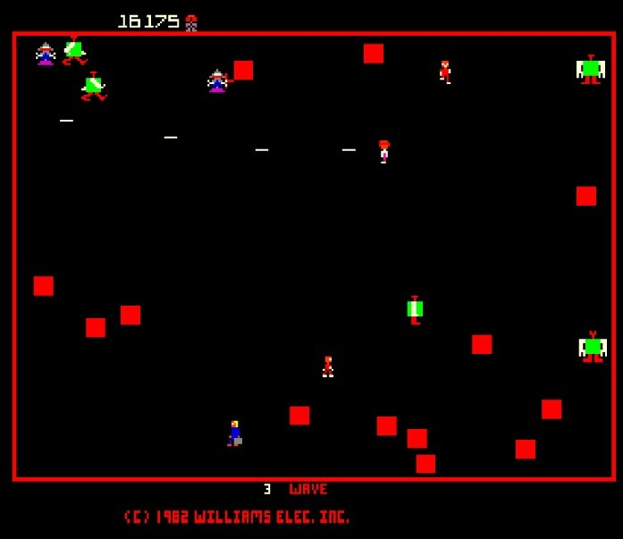

# Robotron RL Player
An attempt at reinforcement learning using the computer to play the game Robotron on the XBox 360.

## Setup:
### Screen Input
I have an HDMI capture card reading the video from the xbox.  I'm using this video to capture the score, lives, and playarea.  I use those to generate the reward and train the network.

### XBox Controller Output
I have an arduino hooked up to an X-Arcade joystick module for the XBox 360.  This allows me to send commands to the xbox via a serial connection to the Arduino.  [More Info](arduino/README.md)

## Training Approach
Training is going to be attempted using a DQN built in PyTorch.

Planned steps:
1. Grab image from XBox
2. Setup Agent
    - Grab the score and lives remaining form the image
3. Prepare Image
     - Crop out the play area.
     - Convert to black and white.  (optional, but color info is probably not required and it should help with network performance.)
4. Send the image to both of our networks.
    - Network 1 will handle character movement and the reward will be based on time alive and civilians collected.
    - Network 2 will handle shooting and the reward will be based on score (minus civilian bumps.)
5. Take the outputs of both networks and send them to the xbox

## Model
Input will be an image 492x665 pixels.  This is the size of the play area.  It'll be one channel (black and white image.)

I'm planning to use a model similar to a VGG network:
1.   Convolution using 64 filters
2.   Convolution using 64 filters + Max pooling
3.   Convolution using 128 filters
4.   Convolution using 128 filters + Max pooling
5.   Convolution using 256 filters
6.   Convolution using 256 filters
7.   Convolution using 256 filters + Max pooling
8.   Convolution using 512 filters
9.   Convolution using 512 filters
10. Convolution using 512 filters + Max pooling
11. Convolution using 512 filters
12. Convolution using 512 filters
13. Convolution using 512 filters + Max pooling
14. Fully connected with 4096 nodes
15. Fully connected with 4096 nodes
16. Output layer with Softmax activation with 9 nodes.  (0 for none plus the 8 cardinal directions.)

Hyperparams and network will be tweaked as I work

## 

If you have any advice or suggestions, please let me know!

You can watch it training (when available) on [Twitch](https://www.twitch.tv/stridera).
