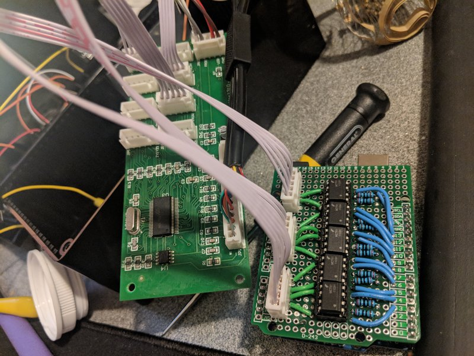
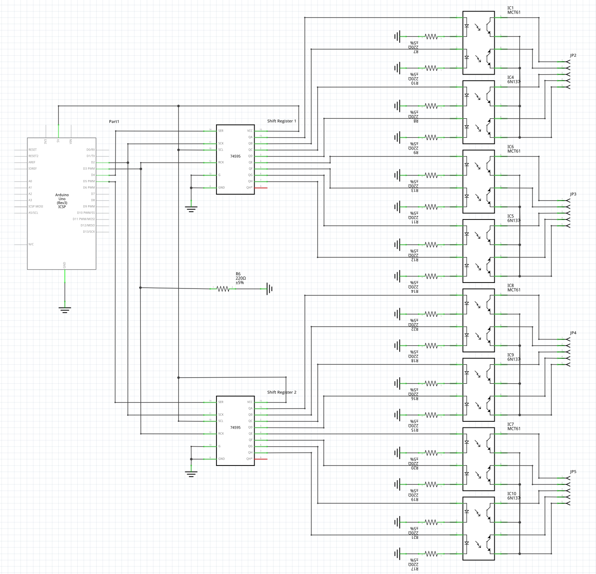

# XBox Computer Control

We are controlling the xbox using an arduino connected to an X-Arcade controller board.

## Hardware
To connect to the XBox, I used parts from [X-Arcade](https://shop.xgaming.com/), and arduino, and a small circuit of optoisolators to 'click' the buttons.

### Parts List
* Arduino Uno with Circuit (Shown below) - Takes input over USB from computer and 'pushes' buttons on the input adapter.
* [X-Arcade Input Adapter](https://shop.xgaming.com/collections/adapters/products/pre-order-new-x-arcade-xinput-upgrade-kit) - Sits between 'controllers' and the device themselves.  In our case, between the arduino and the xbox adapter.
* [X-Arcade XBox-360 Adapter](https://shop.xgaming.com/collections/adapters/products/x-arcade-playstation-3-xbox-1-adapter-2in1) - Plugs into the input adapter and the xbox.  It's what acts as an official controller.

### Circuit
The circuit is simply a group of optoisolators that act as buttons that the user sits.  In simple terms, it isolates the xbox and the computer so you don't get random shorts between the two.  A diagram for both controllers is shown below.  Note that this circuit would require some minor changes to the arduino code to use the shift registers instead of direct pin connections.

## Software
The software is currently designed to work on one byte commands.  I did this primarily for speed, despite knowing that we can send full control sequences far faster than the xbox can process them.  Despite this, each byte is one command.  The first 4 bytes control directional movement (Up, Down, Left, Right) and the next 4 control A, B, X, Y keys that are used to shoot.  SInce you can't press up/down or left/right at the same time, (well, you can, but it makes no sense) I use those as control sequences to send Start and Back.  Look at [the output python script](../src/control/output.py) for how I send the commands to the arduino.
